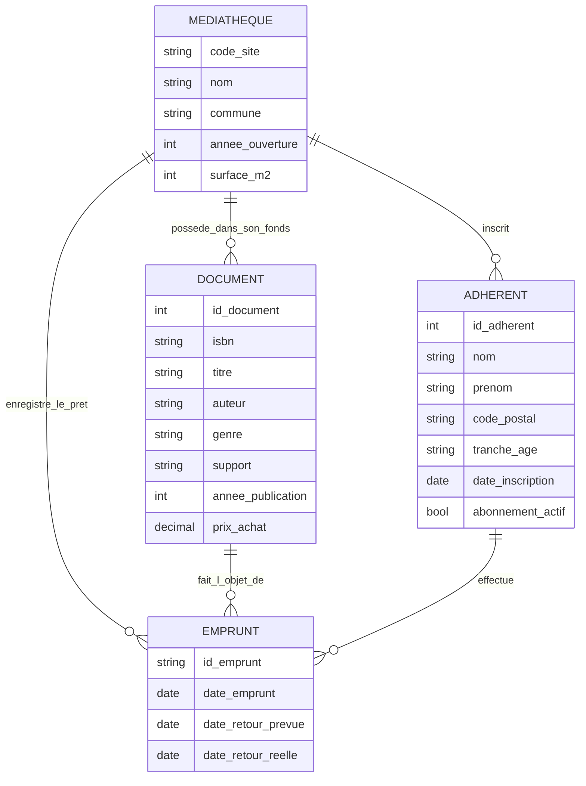
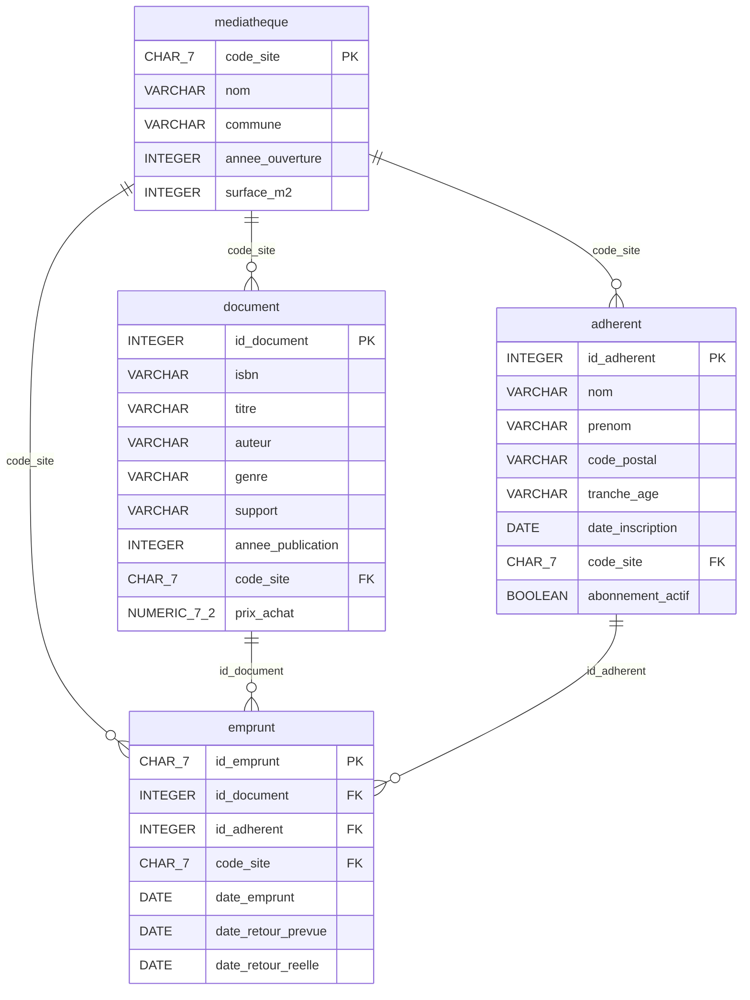

# Modélisation RMML

## MCD

Quatre entités du domaine : médiathèque, document, adhérent, emprunt. Les liens sont des associations métier (pas encore de clés étrangères).

Cardinalités :

- Une médiathèque possède 0 à n documents ; un document appartient à une seule médiathèque (site du fonds).
- Une médiathèque inscrit 0 à n adhérents ; un adhérent est rattaché à une seule médiathèque (site d'inscription).
- Une médiathèque enregistre 0 à n emprunts ; un emprunt a lieu dans une seule médiathèque (site du prêt).
- Un document peut être emprunté 0 à n fois ; un emprunt porte sur un seul document.
- Un adhérent peut faire 0 à n emprunts ; un emprunt est fait par un seul adhérent.

## MLD

Même schéma que le MCD, passé en modèle relationnel : les associations deviennent des clés étrangères, chaque attribut a un type SQL, les clés primaires sont marquées PK.

## Justifications

La clé primaire de `emprunt` reprend l'identifiant source, de la forme `E102224`. Ce n'est pas un entier. On la stocke en `CHAR(7)` : longueur fixe, compacte, et on garde la même clé que dans les CSV pour la reprise des données. Un entier généré par la base obligerait à conserver l'identifiant source à part (colonne UNIQUE), sans gain ici.

Pour `prix_achat`, on utilise `NUMERIC(7,2)` et non un type flottant. `REAL` ou `DOUBLE PRECISION` introduisent des erreurs d'arrondi. Sur des sommes de centaines de lignes, l'écart devient visible. `NUMERIC` garde la valeur exacte en euros et centimes.

`abonnement_actif` arrive en texte (`oui` / `non`) dans les exports. En base, un `BOOLEAN` suffit : vrai ou faux, sans ambiguïté de casse ni de libellé. La conversion `oui`/`non` se fera au chargement.

`date_retour_reelle` doit pouvoir être absente. Un emprunt sans date de retour réelle est un prêt en cours, pas une erreur. La colonne est donc `DATE` nullable. Les autres dates d'emprunt restent obligatoires.

`code_site` apparaît sur `document`, `adherent` et `emprunt`. Ce n'est pas une redondance à supprimer. Sur le document, c'est le site du fonds. Sur l'adhérent, c'est le site d'inscription. Sur l'emprunt, c'est le site où le prêt a eu lieu. Un adhérent inscrit à Lille peut emprunter à Roubaix un document rattaché à Tourcoing. Les trois valeurs peuvent différer ; chacune a un sens métier distinct. On les garde, chacune en clé étrangère vers `mediatheque`.